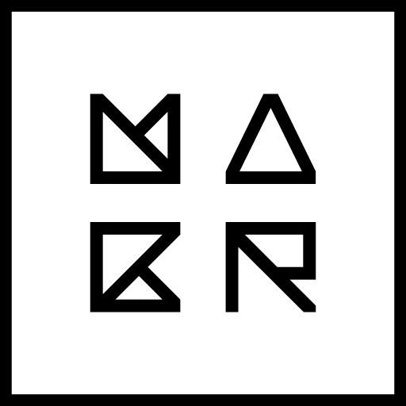
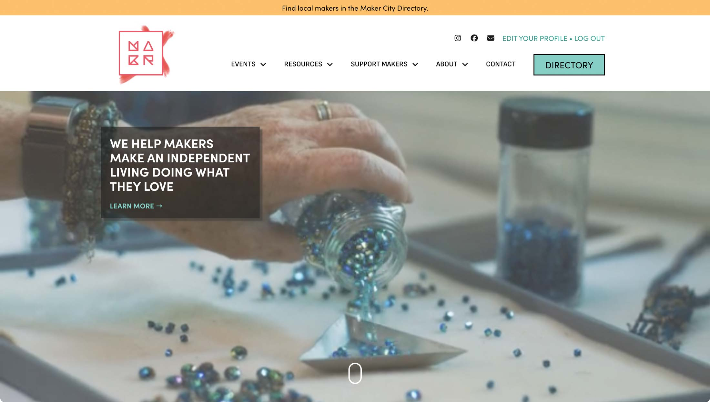

## Overview

This is the repository for [The Maker City](https://themakercity.org) website. Built by [Michael Wender](https://mwender.com) of [Wenmark Digital Solutions](https://wenmarkdigital.com), the website is powered by WordPress utilizing [Bedrock](https://roots.io/bedrock/).

## Changelog

### [1.0.1]
- Added "TikTok" as an option for "Maker Profile > Social Profiles".
- Removed "Email" option from "Maker Profile > Social Profiles".

### [1.0.0] - 2025-04-02
- Initial release.
